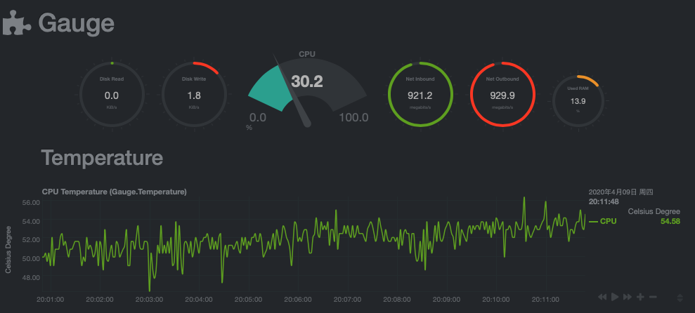
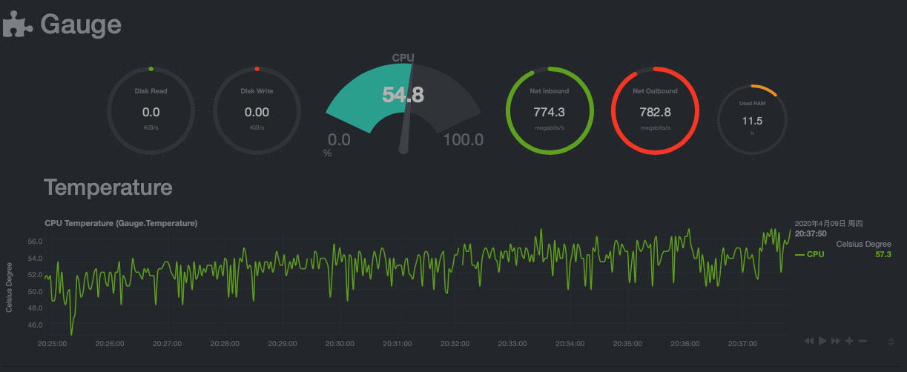
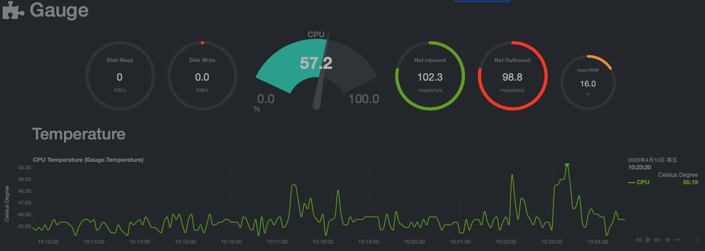

# Nanopi R2S 固件自动编译

 
 

~~编译了两种固件，分别是基于 Lean 的和基于官方固件的。~~

FriendlyWRT 和 FwF 是基于官方固件的版本，主要求稳，没有解锁 CPU 主频，也没添加 Flow Offload，实测性能够用，温度还低，推荐作为家庭主路由拿来长期使用。

点击下方固件名字，可找到对应版本固件的最新下载链接。图形化刷机工具 [luci-app-r2sflasher](luci-app-r2sflasher) 的 ipk 安装包也在下载到的 zip 里。

| 固件名字 | 改动记录 | 简介 |
| :------ | :----- | :--- |
| [FriendlyWRT](FriendlyWRT) | [改动记录](FriendlyWRT/CHANGELOG.md) | 以官方固件为基础, 添加 Lean 的包 |
| [FwF](FwF) | [改动记录](FwF/CHANGELOG.md) | FriendlyWRT with Features, 比上面的固件含有更多功能 |

默认 LAN 口 IP `192.168.2.1` 默认密码 `password`

4月14日之后的版本加入了 [luci-app-r2sflasher](luci-app-r2sflasher), 可以图形化刷机了。

Fork 自 [klever1988](https://github.com/klever1988/nanopi-openwrt) 和 [soffchen](https://github.com/soffchen/NanoPi-R2S)

主要整合了 [Passwall](https://github.com/songchenwen/openwrt-package) 和 AdguardHome

其中 [Passwall](https://github.com/songchenwen/openwrt-package) 是修改版本，支持 Clash。Passwall 比 OpenClash 的好处是，OpenClash 所有流量都需要经过 Clash 转发，有性能损耗。[Passwall](https://github.com/songchenwen/openwrt-package) 可以设置规则只转发部分流量。

WAN 口 DHCP 时，NAT 性能和温度 ⬇️

WAN 口 PPPOE 时，NAT 性能和温度 ⬇️

Fast.com 测速 ⬇️

Fast.com 测速 WAN 口 DHCP 时 CPU 占用和温度 （ WAN 口 PPPOE 的话，CPU 占用增加 20% 左右 ） ⬇️

